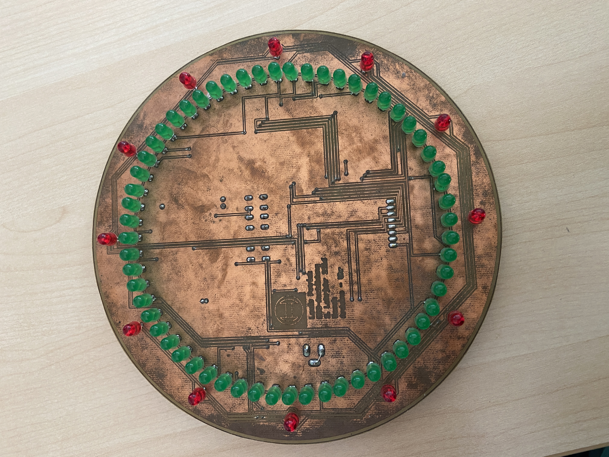
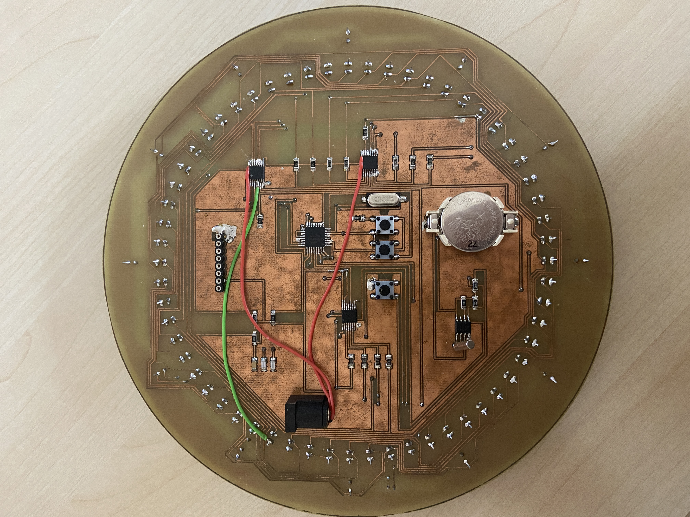
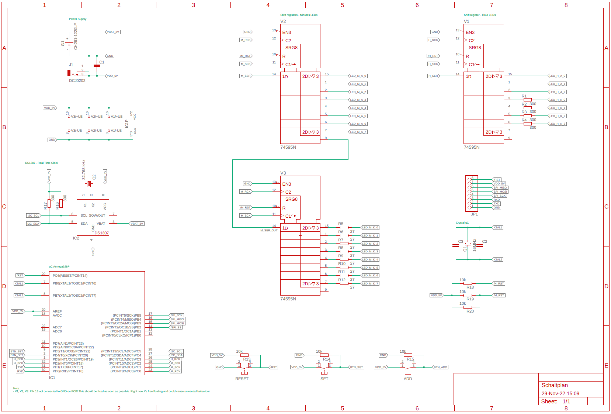

# Digitized Clock
In the third year of my apprenticeship (2016/2017) as an electronics technician for devices and systems, I designed and programmed a ATMEGA328 based digitized clock. "Digitized clock" hereby regards to the the shape of the pcb which mimics an analog clock whith pointers for minutes and hours.

Since I wasn't able to save any schematics or any codebase, I'm trying to "reverse engineer" the schematic of the pcb and write a new software for the clock. The currently programmed software is still in the state from 2017. I still remeber how I struggled to implement a smooth way to set the time via the three buttons. I'm looking forward to improve the usability of the clock to actually mount it to the wall after all those years. 

## Hardware
The ATMEGA328 was choosen to garuantee a easy interface of the hardware with the computer, since it was easily programmable via the Arduino IDE. Back then, this was a somewhat new and reliable way for us to interact with a uC (on a beginner level) which was not already embedded into a finished uC solution.

Back then we had the opportunity to etch our pcbs, which was a lot of fun and always exciting. Unfortunately I made some errors in my design (external wires):

Three [shift registers](ZZ_misc/datasheets/MM74HC595_D-1811503.pdf) are used to control the LEDs. These are organized in a matrix to minimize the traces on the pcb and simplify the code design.  
A [DS1307](ZZ_misc/datasheets/DS1307.pdf) IC is used as a real time clock to keep the time after unplugging the power connection. 

I used the free Version of Eagle (Fusion 360) to create a [schematic](00_Hardware/Schaltplan.pdf) by "reverse engineering" the existing PCB. I'm not too familiar with conventions and rules for creating standardized schematics but the result will work for me and the purpose of understandting the pinout connections of the uC.

Druing this process, I faced a lot of weird placed components and unneccessary complicated traces - I guess I just didn't knew better back then.

## Software
I don't have any detailed plans for the software design yet. My only goal is to find a somewhat nice and clean way of manipulating the bit strings for driving the LEDs

## Error Log
* CS (Pin 14) of uC not connected to programming interface
* /SCLR (Pin 13) of all shift registers is not connected to GND (free floating). Since the clock was working back in 2017 it does not seem to effect the operation of the registers, nevertheless this is not ideal and should be fixed